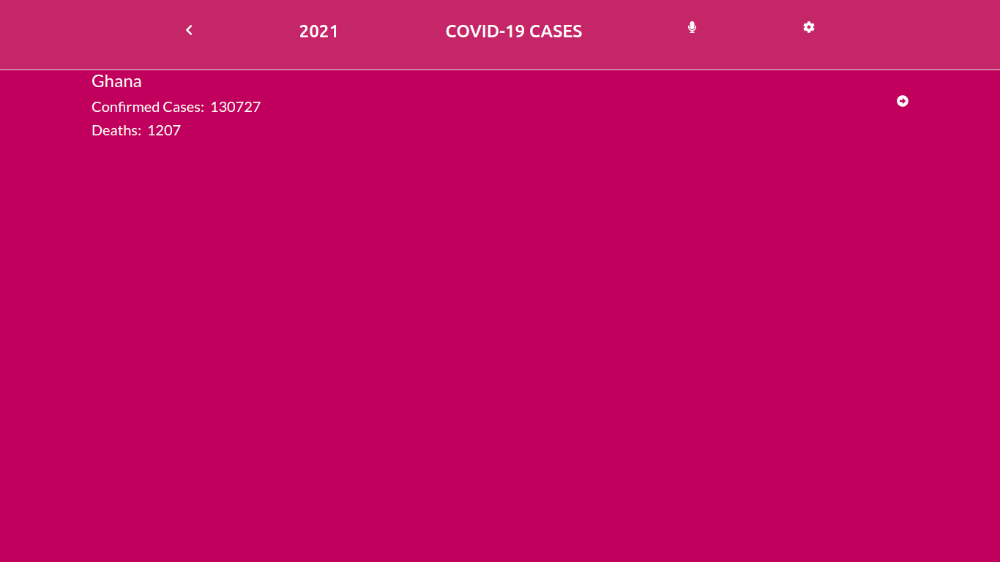

# React and Redux
# COVID-19-TRACKING-PROJECT

> This React capstone project is about building a  web application to check a list of metrics (numeric values) that i created making use of React and Redux..

### Screenshots

|Main Project page

## Built With

- HTML5
- CSS3
- Bootstrap
- Font Awesome
- JavaScript-
- COVID-19 API
- React-Bootstrap
- React-Region-Country
- Jest Test

## Our Project

This project is found on the following Repo [react-capstone-covid-19](https://github.com/TSHEPO-CLOUD/react-capstone-covid-19)

## Live Demo

You can view the live demo of the project [Here!](https://614255540bbc8400e31a7e9a--jolly-tereshkova-efa063.netlify.app/)

### Prerequisites

A Morden Browser

### Setup
- Go to [https://github.com/TSHEPO-CLOUD/react-capstone-covid-19]
- Clone the project to your local machine
- Cd into your directory
- Run npm install
- Type: npm run build
- Run npm start

### Setup
- To Test npm install jest and run npm test
## Author

👤 **Tshepo David**

- GitHub: [@githubhandle](https://github.com/TSHEPO-CLOUD)
- Twitter: [Twetter](https://twitter.com/tshepomolefem)
- Linkedin: [Linkedin]([LinkedIn](https://www.linkedin.com/in/tshepo-molefe-8153313b))

## 🤝 Contributing

Contributions, issues and feature requests are welcome!

Feel free to check the [issues page](https://github.com/TSHEPO-CLOUD/react-capstone-covid-19/issues/3).

## Show your support

Give a ⭐️ if you like this project!

## Acknowledgments

- This project was inspired by the [Microverse](https://www.microverse.org/) for the  program
- Thanks to [The mmediagroup](https://covid-api.mmediagroup.fr//)
- Thanks to [Font Awesome](https://fontawesome.com/)
- Thanks to [ Nelson Sakwa on Behance](https://www.behance.net/sakwadesignstudio/) for the original design

## 📝 License

MIT License
